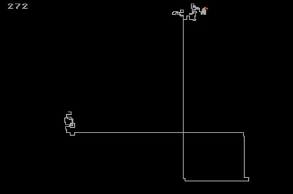

## Advent of code, 2016 - DAY 1 - Atari Basic

This is day 1, and we are hot on the trail of the nefarious Easter Bunny, finding his secret HQ.
The puzzle is actually very easy; creating the Atari experience from BASIC a little less! The files:
* `INPUT.TXT` is my input
* `CODE.BAS` is my file to `LOAD` into Atari Basic.
* `code.txt` is a text version of that.
* `VBI.XEX` is the compiled assembly code and display list data.
* `vbi.asm` is the source code of `VBI.XEX`
* `vbi.lst` is a more annotated version.

### Notes:

* I decided to use Atari's hi-res graphics mono mode, which has a resolution of 320x192, and for
part two to use graphics memory to record whether we'd visited a pixel, hence no extra cost of
searches. This approach was the most fun, but a few challenges along the way.

#### Vertical Resolution and Display Lists

* My input requires 205 vertical pixels, but the native resolution of `GRAPHICS 8+16` in Atari Basic
is 320x192, which uses 40 bytes per line. However, 192 scanlines allows generous top and bottom borders 
for CRT displays, and the Atari lets us build our own display lists, in which we could try to pinch a
few more lines. I went for 320x208. See the first chunk of the assembler code for the display list.

* Video memory in a display list cannot cross a 4k bounday in memory, yet 320x208 uses 8,320 bytes, so 
will cross two such boundaries. A special command called a `load memory scan` in a display list, 
is used to straddle the border, but Basic's `PLOT` and `DRAWTO` commands will get confused if the
memory is not contiguous (which it can't be completely, since 40 is not a multiple of 4096).
Additionally, the built-in `PLOT` function will have problems drawing beyon y=208, even if we solved
all the other things. Hence, I need to write my own `PLOT` function, poking the values directly
into memory. I do this with the large lookup tables, and the plot code that come next in `vbi.asm`.

#### Colour, players, and the VBI.

* The hi-res mode is mono... which isn't very exciting. So, I decided we'd have a small multi-coloured
arrow that tracks our progress. The Atari has `players` and `missiles` - 4 of each - which are overlayed onto
the background. They are the vertical size of the screen, so we have to do some work moving our few
pixels up and down to the right position. Horizontally it is much easier, and a poke is enough to move
left and right.

* I wanted this to be nice and smooth, so I decided to write this in assembler, and have it
automatically called 50 or 60 times a second, using a `vertical blank interrupt`. In BASIC, I put
the position and direction of the player into some convenient bytes (203-207), and the OS calls my
bit of assembler to erase the old position.

* So I have a bit of code that I call to set up the VBI - and it also clears all the screen memory too. It
ends by poking the address of the VBI code into a special place, and calling an OS function to wire in my
code.

* And I have the VBI code itself, which does all the regular updates I want, and then at the end jumps into
the OS VBI code, so the OS can do all the stuff it wants to do every frame.

#### Graphics and text...

* Back in the day when graphics and text were fundamentally different things, we needed routines to
plot the bitmap of the text onto a graphics canvas. I do this at the end of the VBI, and let basic
put the three digits into three spare memory addresses (1536-1538). I then copy the right characters
from the built in character set which starts at address 57344 ($E000).

#### The Basic Code.

So, lots of useful work is done in the assembly code. BASIC just has to...

* `0-5` Read in the assembly code
* `10` Decide whether we're doing part 1 or 2.
* `15` Wire in the modified display list. (Have to turn the display off while you do it)
* `17` Reset the three digits to zero
* `20` Set the VBI going, set the colour of the two players, and intialise some vars.
* `25-35` Start reading the input file. Expect `R/L` and some digits, then a comma.
* `40-45` Work out our new position.
* `50` Call the PLOT function, which returns whether or not a pixer was already there.
* `52-55` Pad the three-digit step count, and POKE into the right place.
* `57` End condition for part 2
* `58` Keep doing however many steps were indicated.
* `60` Read a space from the input, then we should be ready for next `R/L`, or code 10 is end of line.
* `65-70` We're done. Do some exciting sound and flashing.

