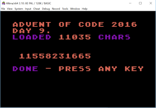

## Advent of code, 2016 - DAY 9 - Atari Basic

### Overview:

The algorithm for this challenge is fairly easy - especially for part 1, and I think part 2 is a recursive
extension, provided the input is nicely behaved. The problems we'll need to workaround for Atari Basic will be the
lack of functions (let alone recursive calls), and also the final answer for part 2 is a large integer, too large
for using the normal numerical support.

### The workarounds:

* For large integer support, we'll use a big string, and write some school-arithmetic to add them up digit by digit.
* For recursive function support, we'll use arrays to store the recursive-level-specific variables, including the
return values. Atari Basic allows nested `GOSUB` calls to the same lines, which unravel when you `RETURN`,
so all we're really missing is variable scoping within a function.

### The Code

* 0: `GRAPHICS 18` is the big text mode a bit like `GRAPHICS 2`, but if you add 16, there is no text window at the bottom.
* 1: Read the data into memory, starting at address `16384`. Abort when we read white space, specifically `ASCII 10`, 
since the spec says we don't include it. `POKE 709` changes the colour of all the text printed as lower-case, in this
graphics mode, so we are entertained while we wait...
* 2: `L` is the now the number of characters read, which will exist in memory locations `16384` to `16383+L`.
* 3: Choose part 1 or part 2, get some strings ready...
* 4: `A$` will represent our total. I allow twelve digits, right-aligned ASCII numbers, preceded by ASCII zero until
the start of the string. Remember strings are indexed from `1`. `B$` is going to be the thing to be added to `A$` at
any time. And `C$` is a spare if we needed it. `Q` is going to be the index of the character in the big string that
we're dealing with - starting from zero. (Hence, it comes from memory `16384+Q`.)

#### Later functions:

* 20-27: `ADD` - adds the integer represented in `B$` to the integer represented in `A$`. 
* 21: `C$` becomes `B$` shifted to the right of the string, and fill the early part with NULL (ASCII 0). Swap to `B$`.
* 22: Go from right to left. If `A$` and `B$` are both `NULL`, and there is no carry, then we've finished.
* 23-24: Otherwise, set NULLs to number zero in that column.
* 25: Add the digits at that column, and if more than 10, subtract 10 and set carry flag.
* 26: Set digit for that column in `A$`, and continue loop
* 27: Done.

* 30-35: `BRACKET` - `Q` should start pointing to an open bracket character.
* 31-32: Skip opening bracket, then parse digits for `C`, until we reach an ASCII code later than number `9` - which must be the `x`.
* 33-34: Skip the `x`, and parse digits for `F`, until we reach a ASCII code earlier than number `0` - which must be the close bracket.
* 35: Increment `Q`, so that this function returns with `Q` pointing to the first character after the close-bracket.

#### Part 1

* 5: As `L` is the number of characters, and `Q` is the zero-based index, we finish if `Q>=L`. If the character at `Q`
is not an open-bracket, then we add `1`, increase `Q`, and carry on with the next character.
* 6: If however it's a bracket, then call `BRACKET`, which parses the contents of the bracket into variables `C` (count), and `F` (freq). `Q`
now points to the first character after the close-bracket. Make `Q` skip `C` further characters, and add `C*F` to the
count for decompression. And carry on processing from the resting place of `Q`.
* 7: We're done. `POKE 764,255` clears the (single-character) keyboard buffer...
* 8: Pulsate some some colour (`PEEK(20)` looks up a built-in counter), and wait for a keypress before rerunning.
`POKE 77,0` cancels screen-saver attract mode.

#### Part 2

`DEPTH` refers to the recursive depth we are currently at. The idea is that whenever we reach a bracket, parse the
`C` and `F` as before, but then recursively call the decompress function on the range of `C` characters after the
close-bracket. If there are further open-brackets within that section, then recurse further. Hence, you could imagine
having a function `FUNCTION DECOMPRESS(X1, X2) : BIG_INTEGER`. But since we dont' have that, we'll say:
* `X1(DEPTH)` is the starting character, for a recursive call at that depth.
* `X2(DEPTH)` is the ending character plus one, for a recursive call at that depth.
* `M(DEPTH)` remembers the value of `F` before the function call - when one recursion returns, and `DEPTH` becomes
`DEPTH-1`, we'll need to multiply the result by `M(DEPTH)` 
* `RD$(12*DEPTH) is space for the return of each recursive function.

Now, on with the code:
* 9: Set things up. The strange bit assigning `CHR$(0)` to various bits in `RD$` is a weird Atari Basic thing to fill
a string (very quickly too). So I fill it with nulls, and then just set `RD$(12,12)` to zero - this is the right-most
digit of the return value for the first recursive function. `RD$(1,12)` will effectively be our final return.
* 10: Set `X1` and `X2` at the top-level depth 1: do the whole string.
* 11: The line after this will be the multiple-entry recursive "functional call"...
* 12: Get the appropriate `A$` out of `RD$`, and the `Q` pointer - wherever it left off.
* 13: IF `Q` has reached `X2` for this depth, then we're done for this function call, so unravel... (see 19). Otherwise,
check for open-bracket at `Q`. If it's not, then add 1 to `A$`, push it into the right place in `RD$`, increment `Q` and continue.
* 14: If it was an open bracket, then work out `C` and `F` - which moves `Q` to the character after the bracket. The next character
the current function depth must continue at is `Q+C`, so put that in `X1(DEPTH)`. Remember `F` in `M(DEPTH)`, as we'll
neeed to multiply the result of the recursive function call by it - but by that time `F` may have been overwritten.
* 15: Emulate the recursive function call. Increase depth. Initialise default result for that depth to zero.
* 16: Set `X2` for the new depth (should be last character plus one), to the place where the original depth continues from. 
`X1` is the character after the close-bracket we found - or `X2-C`. Then recurse - by `GOSUB` 12.
* 17: When the recursion returns, Make `B$` the result of the recursion, reduce `DEPTH`, and make `A$` the running total from that reduced depth.
* 18: It would run quicker if I wrote string-multiply, but anyway. Add `B$` to `A$` `F(DEPTH)` times, and save the result into RD$ for
the depth. Then keep looping on with the next characters at that depth - a `GOTO 12` instead of a `GOSUB`.
* 19: If we've done all the characters we were meant to do, then for depths more than `1`, we were in a recursive
function so `RETURN` out of it. Otherwise we're finished.

