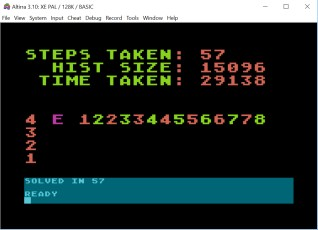

## Advent of code, 2016 - DAY 11 - Atari Basic

One of the toughest puzzles in the year, I thought.

### Overview

So, it's basically about getting items across a river where there are only certain combinations that can
be left in safety. A matched generator-chip pair is safe, but if a chip is not with its buddy-generator, 
then any other generator present will fry it. In each move between floors, you can carry one, or two, but
not zero items. 

### I cheated...

1. Well, not much. I solved the problem using a breadth-first search in Java first, because I wanted to know
how much memory I would need. If more than about 32k, then I'd have to consider using the massive 128k
Atari 130XE; if more than that, then I'd probably think about whether a depth-first search with a limited
number of steps might work (although it would likely take more than my lifetime to complete). Anyway. 
Breadth-first search required about 15k of RAM, so I can do it in standard Atari Basic. 30 years ago I
wouldn't have had this luxury, to know which algorithm to go for.

2. I also didn't write proper parsing for the input file. It's tedious in Atari Basic,
and not very interesting code. So my own input is hard-coded for both parts.

### The Algorithm

So, breadth-first search is the way I used, with a lot of pruning. 
* If a chip is not with its buddy, and another generator is there, it doesn't matter which other generator 
it is, our chip gets fried. Hence, the important thing is where the buddy-pairs are; all other generators
are enemies...
* Hence,if you store the state as a list of pairs deterministically sorted, that
give the floors at which (chip,generator) are sitting, then that's enough to know a future state that
produces the same list is equivalent and shouldn't be revisited.
* Some other slightly helpful optimisations were in the forums - I didn't think of these, and I'm not sure I
totally trust them for all input, but they worked for mine, and got me to the 15k. So, again, I've cheated a
bit here.
* If you can take two objects up, don't take only one, as you'll have to come back (carrying another item) to
get the other one. Similarly, if you can take one item down, do that rather than taking two.
* Once you've got all the items above a certain floor, don't take any down to it again.

### The Code

Much longer code, and I've mimmicked some functions here (which Atari Basic doesn't have), using `GOSUB` to named 
line-numbers, and setting particular variables as return types.

#### Initialisation

* Throughout these functions, `E` is a number 0-3, and `S$` is a string of ASCII codes between 0-3, representing the floor
number (starting from zero) of the elevator, and of each item respectively. The order of items in `S$` is generator-1, chip-1,
generator-2, chip-2 - and so on, for all the pairs. Crucially, it doesn't matter the order of pairs; those states are
equivalent.

* The history is stored in RAM, starting at address `16384`.

* 0: `IS` stores the number of items - 10 or 14 for the two parts. `DEPTH` stores the current number of steps we've done
in the breadth-first search. Get a key, 1 or 2, for which part to run. `GRAPHICS 2` is a mode with 20-col coloured text at
the top, and three lines of 40-col mono text in a window at the bottom. `? #6` prints to the top, and normal `?` prints 
in the bottom window.
* 1: Initialise for part 1.
* 2: Initialise for part 2.
* 3: Convert the human-readable S$ and F$, with characters 0-3, into ASCII codes 0,1,2,3.
* 4: Add the initial state to the history.
* 5-6: Read the binary assembler code into Page 6 - a free 256-byte blob for small routines like the `MC_SEARCH` one
we have here. The `XEX` file is a standard form for Atari executables; the first 6 bytes are header, so I skip those
to just get to the binary payload. (The GOSUB 15 is a late addition - just to set up some labels on screen).
* 7: Do we want a beautiful display or not? The Atari runs considerably faster if graphics are turned off.
* 8: Clean up the open channels for keyboard and file. `GRPH` is the flag for whether we want graphs. `POKE 559,0` turns the
graphics completely off if we don't want it.

#### The main loop

The main loop is an infinite sequence of the following - broken only when we find the solution.

* `DPOS` is the position in the history, of the state we are considering to be the parent.
* `DSTARTP` is zero the first time the whole loop is executed.
* `DENDP-1` is also zero the first time the whole loop is executed.

The first time the whole loop is executed, is for `DEPTH=0`. There is one state, for `DEPTH=0` - our starting state,
which is, non-coincidentally, the only item in the history at present, sitting at `DPOS`. When the loop is next run, 
`DSTARTP` will be the start of the first item in the history that was found at `DEPTH 1` - and DENDP-1 will be the start
of the last item at `DEPTH 1`. So, the loop covers all the `parent nodes` at a certain depth; it results in more
nodes being added onto the history for consideration in the following loop, for `DEPTH+1`.

* 9: Start the loop. Unsquash from RAM, into (E, S$). Firstly consider moving up (`DIR=1`)
* 10: If the lift is not at the top, try moving two items. If that wasn't successfully, try moving 1.
* 11-12: Work out the "base" - the lowest floor that has some item on it.
* 12: If we're above the base, then try moving one item down; if that wasn't successful, then try moving 2 down.
* 13-14: If graphics is on, update the display. Finish the loop, and move onto the next depth. Set the range of the next 
loop; it should start at the first newly-added state from the loop that just finished, and it should end at the current
last item in the history.

#### Some graphics

* 15: Print some labels on the screen. In this graphics mode, lower-case is printed as capital letters, but in a
different colour.
* 16: Memory locations 18, 19, 20, are counters; 20 counts the number of 1/60s of a second (for a PAL-based Atari);
when that overflows, it increases location `19`, and when that overflows, it increments location `18`. We can set them
all to zero to reset the counter. I'm interested in how long this takes. Note also that this time is "virtual" - my
emulator runs at warp speed so things happen a lot more quickly, so these counters track how long it would have taken
on Atari hardware.
* 17: Update the top display with the depth and history size, and calculate the elapsed (virtual) time in seconds.
* 18: Plot the time, stop screen-saver colour cycling (`POKE 77,0`), and draw the lift. (ASCII 229 is an inverse lower
case `e`, which gets drawn as an upper-case E in blue.
* 19-23: Plot the different generator/chips by number in different colours. The animation is a bit weird since we're
plotting the progress of a breadth-first search. But anyway, I had to draw something.

#### The other subroutines

* 30-35: `SQUASH` - pack the state `(E, S$)` into `Q$` - a string of 3 bytes for the first 
part, and four parts for the second.
* 36-43: `UNSQUASH` - unpack the three (or four) bytes from memory address `16384+DPOS` into `(E, S$)`.
* 45-48: `ADDHIST` - add contents of `Q$` to the history, starting at `16384+TAILP` - and updated `TAILP`.
* 50-55: `SEARCH` - Look through memory from `16384` to the byte before `16384+TAILP`, in steps of 3 or 4, 
depending on which part, to look for the values currently in `Q$`. If they are found, then return `FOUND=1`, otherwise
`FOUND=0`. For extra speed, I replaced this with some assembly code - see 85-87, and more later...
* 60-65: `MOVE2` - Try to move two items in direction `DIR` (1 or -1). `S2$` preserves the original state, then `S$` is
updated, as all the other functions work on `S$`. A move is valid if both items start on the same floor as the elevator,
and the proposed state is safe for all chips. If it is valid, then `SUCCESS` will be `1`, otherwise `0`. If it is safe, 
then normalise it (so that equivalent states are comparable), check it doesn't occur in the history, and if it doesn't,
then add it to the history. Exit if we've proposed the finished state, `F$`.
* 66-70: `MOVE1` - Similar to `MOVE2` but only carry one item. Exit if we've proposed the finished state.
* 71-76: `SAFE` - Check whether the state in `S$` is safe for all chips. A chip is safe if it is in the same place as its
generator, otherwise, it is unsafe if another generator is present. Return `OK=1` if the state is safe, otherwise `OK=0`.
* 77-84: `SORT` - or normalise; this swaps pairs in `S$` in increasing order of which floor the microchip of each pair is on. For
chips on the same floor, sort in increasing order of the floor their matching generator is on.
* 85-87: `MC_SEARCH` - poke the contents of `Q$` into locations 203, 204, 205 and for part two, 206. These are in page
zero which makes assembler instructions that refer to them faster. Then call the machine code at location 1536 (page 6), 
with parameters specifying the size of `Q$` (3 or 4), and the address of the byte immediately after the end of the history.
(ie, where the next history will be written).
* 99: The end. Turn the screen back on, update the display to show the stats.

#### The machine code search

See `search.asm` and `search.lst` for the code. It's very simple, and about twice as fast as lines 50-55. It might
seem tempting to have the list sorted, since effectively we could treat all states as 3 or 4 byte integers for comparison.
Then we could use a binary-chop and insert to add items (which would be slower than
just appending to the end) - but then use a binary-chop to search for existing items (which would be quicker than 
the linear search). 

However, it's not totally clear what the benefit would be in performance. Moreover, the main problem is
that we want a history that is sorted by depth, not by the integer values of states. Some hybrid might help - 
sorting the history for previous depths by integer, and then adding new states to a different new list. We might get
a bit more speed up that way. But that's not for today.

Anyway. A linear machine code search is pleasantly simple to write, if you like that sort of thing. 

* I've hard-coded 16384 as the first place to search. 
* I self-modify the `ADC #` value with 3 or 4, depending on what parameter was passed to the function (`PLA` pulls firstly the number of args, followed
by each arg in MSB, LSB order. All args must be`PLA`ed before the final `RTS`, or everything crashes.
* `CLC` clears the carry flag - all of the additions add 3 or 4 to the LSB, and increment the MSB if the carry flag is
set. (Or more specifically, don't increment MSB if the carry flag is clear).
* I also self-modify the loop end condition with the second parameter supplied.
* The rest should be simple. To return a value back to basic (ie, `FOUND=1` or `FOUND=0`), we poke the value into
locations 212 (LSB) and 213 (MSB).

### Performance.

Well. It takes 671 seconds to run part 1, and 29138 seconds for part 2. These are a lot of seconds, but according to
the forums, some people took much longer with unoptimised code on rather faster machines... which I guess is the 
point of the puzzle.