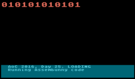

## Advent of code, 2016 - DAY 25 - Atari Basic

### Overview:

So, this is probably about just reading the AssemBunny code, but seeing as it's
so similar to Day 23, maybe implementing it a bit will help. And it'll be nice
to see one last Atari Basic screen filling up with 1s and 0s. There are no `tgl` 
commands in the code, but there is now `out`. So the quickest changes to the opcode
table are...

No. |  Opcode. |  Arg 1  | Arg 2  | Compile as                  |
----|----------|---------|--------|-----------------------------|
  0 |   CPY    |   num   |   num  |   skip                      |
  1 |   CPY    |   num   |   reg  |   [reg] = num               |
  2 |   CPY    |   reg   |   num  |   skip                      |
  3 |   CPY    |   reg   |   reg  |   [reg] = [reg]             |
  4 |   DEC    |   num   |        |   skip                      |
  5 |   DEC    |   reg   |        |   [reg]--                   |
  6 |   INC    |   num   |        |   skip                      |
  7 |   INC    |   reg   |        |   [reg]++                   |
  8 |   JNZ    |   num   |   num  |   if num<>0 goto pc+num     |
  9 |   JNZ    |   num   |   reg  |   if num<>0 goto pc+[reg]   |
  10|   JNZ    |   reg   |   num  |   if [reg]<>0 goto pc+num   |
  11|   JNZ    |   reg   |   reg  |   if [reg]<>0 goto pc+[reg] |
  12|   OUT    |   num   |        |   Print num                 |
  13|   OUT    |   reg   |        |   Print [reg]               |


### The Code

* The same as Day 23, except the `tgl` is no longer matched, and `out` is matched instead on 
line 8. There's no need for the toggle data which was previously line 15, and lines 32,33 are
now easier to compile for `out`, than they were for `tgl`. The code also never terminates. I
decided I'd like big red text for the `0101`, so we have a `GRAPHICS 2` mode, with a blue
text window at the bottom which we can `?` (that is, print) onto, and `? #6` prints to the
big red section at the top.

### Alright then

So, the Assembunny code is like this.

```

| Line  | Code       | Meaning...                               | Or...                     |
|-------|------------|------------------------------------------|---------------------------|
|   1   | cpy a d    | d = a                                    | - d = a                   |
|   2   | cpy 11 c   | c = 11                                   | -                         |
|   3   | cpy 231 b  | do { b = 231                             | -  + (2541)               |
|   4   | inc d      |      do { d++                            |                           |
|   5   | dec b      |           b--                            |                           |
|   6   | jnz b -2   |         } while b!=0                     |                           |
|   7   | dec c      |      c--                                 |                           |
|   8   | jnz c -5   |    } while c!=0                          |                           |
|   9   | cpy d a    | do { a = d                               | (d never changes)         | 
|   10  | jnz 0 0    |      do {                                |                           |
|   11  | cpy a b    |           b = a                          |  b = 2541 + a 
|   12  | cpy 0 a    |           a = 0                          |
|   13  | cpy 2 c    |           do { c = 2                     |
|   14  | jnz b 2    |                do { if b!=0 goto 16      |
|   15  | jnz 1 6    |                     else goto 21         |
|   16  | dec b      |                     b--                  |
|   17  | dec c      |                     c--                  |
|   18  | jnz c -4   |                   } while c!=0           |
|   19  | inc a      |                a++                       | a = d / 2
|   20  | jnz 1 -7   |              } while true                | c = 2 or 1
|   21  | cpy 2 b    |           b=2                            |
|   22  | jnz c 2    |           do { if c!=0 goto 24           |
|   23  | jnz 1 4    |                else goto 27              |
|   24  | dec b      |                b--                       |
|   25  | dec c      |                c--                       |
|   26  | jnz 1 -4   |              } while true                | if c=2, b=0
|   27  | jnz 0 0    |                                          | if c=1, b=1
|   28  | out b      |           print b                        |
|   29  | jnz a -19  |         } while a!=0                     |
|   30  | jnz 1 -21  |    } while true                          |
```

* So Lines 1-8 add `11*231` to the initial value of `a`.
* Lines 13-20 result in `a` being halved. If it divides exactly, then `c` will be
2 afterwards, otherwise it will be `1`.
* Lines 21-28 then makes `b` 1 if `c` is 1, otherwise `b` is 0. And that's what gets printed.

### The Final Act

* Hence, `b` is the remainder each time of repeatedly dividing the starting value of `a` (plus 11*231) by 2.
The resulting number, if a=0, has twelve binary digits.
* which is like converting that initial number to binary, then flipping all the digits.
* So, if we want to produce `010101010101`, then, flip the bits to `101010101010` which in decimal is 2730, and
subtract (11*231), which gives 189, the right answer for my input.
* The first part, of course, takes quite a long time for Atari Basic to execute.
* But it gets there in the end.

* Like this.


